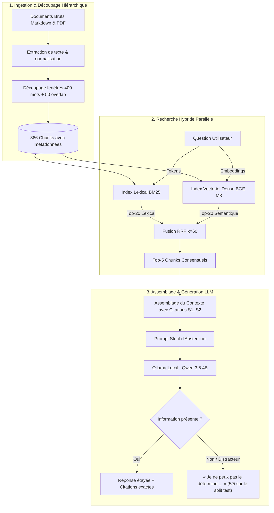

# RAG From Scratch : Modular Local Engine

[](https://www.python.org/)
[](LICENSE)
[-100%25-brightgreen.svg)](#tableau-comparatif-des-performances)
[-5%2F5-brightgreen.svg)](#limites-et-précautions-de-lecture)
[](#limites-et-précautions-de-lecture)

Un moteur de **Retrieval-Augmented Generation (RAG)** construit de zéro en Python, sans framework RAG (ni LangChain ni LlamaIndex). Il dépend de `numpy`, de `pdftotext` (poppler) et d'un serveur Ollama local. Il combine une recherche hybride (**BM25 lexical enrichi + Embeddings denses BGE-M3 fusionnés par Reciprocal Rank Fusion**), un modèle de langage local via **Ollama (Qwen 3.5)**, des citations traçables et une consigne d'exclusion stricte anti-hallucination.

Le corpus pilote porte sur l'UV de master **IA04 (Systèmes Multi-Agents)** : 20 documents sources (supports de cours Markdown, sujets de TD, annales d'examens en PDF).

---

## Architecture du Système



---

## Points Clés & Différenciation

- **Zéro boîte noire** : Le tokenizer, le calcul Okapi BM25, la similarité vectorielle cosinus et la fusion RRF sont entièrement implémentés sans framework RAG.
- **Indexation lexicale légère** : l'index BM25 se construit en moins de 0,1 seconde en mémoire. Cette mesure ne couvre pas les embeddings denses (`bge-m3`), dont le calcul est le poste coûteux de toute recherche vectorielle (37 s pour LlamaIndex sur dev, qui ne calcule que des embeddings). Les deux chiffres ne mesurent pas la même chose et ne se comparent pas.
- **Abstention** : 5 abstentions correctes sur 5 questions sans réponse du split `test`, grâce à une consigne d'exclusion stricte (échantillon très petit, voir les limites ci-dessous).
- **Rigueur scientifique** : Benchmark sur 30 questions privées, partitionnées en sous-ensembles étanches `dev` (calibrage) et `test` (validation finale en aveugle), avec une baseline LlamaIndex mesurée sur le split `dev` uniquement.

---

## Installation Rapide

```bash
# Cloner le dépôt et installer en mode éditable
git clone https://github.com/JeanVG23/rag-from-scratch.git
cd rag-from-scratch
pip install -e .

# (Optionnel) Installer les dépendances d'évaluation et de tests
pip install -e ".[all]"
```

---

## Utilisation Python (SDK)

Le moteur s'utilise directement dans n'importe quel script Python :

```python
from rag_from_scratch import RAGPipeline

# Instancier le pipeline RAG hybride de bout en bout
rag = RAGPipeline.from_chunks("data/gold/ia04_chunks.jsonl", retriever_type="hybrid")

# Poser une question
response = rag.query("Quels éléments permettent de distinguer un agent d'un système multi-agent ?")

print(response.answer)
print("\nSources citées :")
for citation in response.citations:
    print(f"- [{citation.label}] {citation.source_path} ({citation.locator()})")
```

---

## Utilisation en Ligne de Commande (CLI)

Depuis la racine du dépôt, construire les chunks IA04 puis lancer une recherche ou une génération augmentée :

```sh
# 1. Construction des unités et découpage des chunks
PYTHONPATH=src python3 -m rag_from_scratch.cli build-chunks

# 2. Recherche (Hybride RRF par défaut, ou --retriever bm25 / dense)
PYTHONPATH=src python3 -m rag_from_scratch.cli search "Comment les agents communiquent-ils ?" --top-k 5
PYTHONPATH=src python3 -m rag_from_scratch.cli search "Quel problème d'appariement est posé au médian A21 ?" --retriever hybrid

# 3. Génération augmentée avec citations et consigne stricte d'abstention
OLLAMA_CHAT_MODEL=qwen3.5:4b PYTHONPATH=src python3 -m rag_from_scratch.cli ask "Quel problème d'appariement est posé au médian A21 ?"

# 4. Évaluations quantitatives
# Comparaison de recherche (BM25 vs Dense vs Hybride)
PYTHONPATH=src python3 evaluation/run_hybrid.py --questions evaluation/private/ia04_questions_test.jsonl

# Évaluation de bout en bout de la génération et de l'abstention
OLLAMA_CHAT_MODEL=qwen3.5:4b PYTHONPATH=src python3 evaluation/run_generation.py --questions evaluation/private/ia04_questions_test.jsonl --retriever hybrid --overwrite

# Baseline externe de comparaison (LlamaIndex)
PYTHONPATH=src python3 evaluation/run_llamaindex.py
```

### Options du CLI

- `search` et `ask` acceptent `--retriever {hybrid,bm25,dense}` (activé sur `hybrid` par défaut).
- `--top-k` spécifie le nombre de passages renvoyés ou fournis au contexte (par défaut `5`).
- `--dense-model` spécifie le modèle d'embeddings Ollama (par défaut `bge-m3`).
- `--rrf-k` ajuste la constante de lissage de la fusion par rang réciproque (par défaut `60`).
- `--min-bm25-score` permet d'activer un seuil minimal de score en mode BM25.
- La génération (`ask`) fonctionne par défaut à température `0`, avec thinking désactivé et une limite de 384 tokens pour une exécution déterministe et rapide.

## Approche d’implémentation

*Cette section et les deux suivantes reprennent le plan de départ, rédigé au futur. L'état final (v9) est décrit dans « État du projet » plus bas.*

Dans les premières étapes, les briques principales seront construites une à une, sans framework RAG, base vectorielle ni bibliothèque de recherche qui masque leur fonctionnement. Les bibliothèques de la collection standard de Python pourront être utilisées quand elles ne remplacent pas une brique étudiée.

Les premières versions sont des **baselines de recherche**. La commande `ask` ajoute maintenant une première génération locale avec les passages récupérés comme contexte et des références dans la réponse ; sa qualité doit encore être mesurée avec la grille du protocole.

**Méthode de travail.** Je n'ai pas écrit le code de ce dépôt : il a été écrit par un assistant IA (Claude Code), sous ma direction, de même qu'une partie de la rédaction des rapports. Ma part est la conception (architecture, ordre des étapes, BM25 avant le dense, fusion par rangs, consigne d'abstention), le protocole d'évaluation (questions, annotations, notation manuelle, lecture des résultats) et la relecture critique des affirmations. Les mesures sont à lire avec les limites indiquées plus bas.

## Itérations prévues

Chaque étape devra rester exécutable et avoir une évaluation associée.

1. **Corpus et questions d’évaluation** : inventorier les sources, préparer des questions représentatives et noter les documents ou passages attendus.
2. **Baseline naïve** : découper simplement les documents et classer les passages à partir des mots communs avec la question. Cette version servira de référence et restera archivée.
3. **Ingestion et découpage** : mieux préserver les titres, pages, métadonnées, frontières de sections et chevauchements entre passages.
4. **Recherche lexicale** : implémenter et comparer des méthodes comme TF-IDF et BM25, sans déléguer le classement à une bibliothèque spécialisée.
5. **Assemblage et génération** : première version disponible avec BM25 et Ollama local ; évaluer couverture, fidélité au contexte, citations et abstention avec la grille dédiée.
6. **Comparaison** : mesurer les variantes manuelles sur le même corpus et les mêmes questions, puis les comparer à une solution utilisant des bibliothèques établies.

Cet ordre pourra évoluer si les évaluations montrent qu’une autre amélioration est prioritaire. Les changements de méthode et leurs raisons seront consignés.

## Évaluation

Un jeu de questions préparé à l’avance permettra de comparer les versions sur des bases identiques. Pour la recherche, on pourra suivre notamment le rappel des sources attendues dans les `k` premiers résultats (Recall@k) et le rang réciproque moyen du premier résultat pertinent (MRR). Pour les réponses générées, on vérifiera si elles répondent à la question, s’appuient sur les passages fournis et citent correctement leurs sources. L’évaluation du système reste un objectif ; la publication d’un jeu de test indépendant des documents de cours dépendra du temps disponible.

Les résultats devront inclure les paramètres utilisés et les erreurs observées, pas seulement quelques exemples réussis. Les questions et critères de référence seront gardés fixes pendant la comparaison des itérations ; toute évolution du jeu d’évaluation sera elle aussi documentée.

## Historique et archivage des expériences

Git conservera l’historique du code. Chaque version importante pourra être identifiée par un tag, par exemple `rag-v0-naive` ou `rag-v1-bm25`. Un rapport associé consignera :

- l’objectif et les changements de l’itération ;
- le commit ou tag du code utilisé ;
- les paramètres et la version du corpus ;
- les résultats d’évaluation ;
- les limites constatées et la motivation de l’étape suivante.

Cette méthode garde les premières implémentations consultables et comparables sans maintenir plusieurs copies ambiguës du même code.

## Périmètre et limites

- Le développement initial porte uniquement sur IA04, même si d’autres cours sont déjà présents dans `data/raw/`.
- Le premier moteur lexical retrouvera surtout les passages qui partagent des mots avec la question. Il ne saisira pas nécessairement les paraphrases ou les synonymes.
- La qualité de l’extraction PDF et des figures ou tableaux sera examinée séparément ; une conversion en texte peut perdre de la structure.
- L’entraînement d’un grand modèle de langage ou d’un modèle d’embeddings n’est pas un objectif. L’utilisation d’un modèle sera ajoutée comme composant distinct, afin de garder visible le code du pipeline RAG.

## Données et diffusion

Les documents de cours et les données dérivées ne seront pas distribués avec le projet. Le dossier `data/` est ignoré par Git via `.gitignore` ; `data/raw/` contiendra les sources utilisées pendant le développement. Le code public devra expliquer où placer les documents localement et comment lancer l’indexation, sans inclure leur contenu.

## État du projet (Version finale v9)

Le projet a atteint l'ensemble de ses objectifs initiaux et dispose d'une suite complète d'expérimentations reproductibles :

1. **Ingestion & Découpage hiérarchique** : 20 documents IA04 (334 sections Markdown, 23 pages PDF) segmentés en 366 chunks préservant les chemins de sections et numéros de pages.
2. **Recherche Hybride From-Scratch** : Intégration de BM25 avec métadonnées et d'une recherche vectorielle dense (`bge-m3`), fusionnées par *Reciprocal Rank Fusion* (RRF, $k=60$).
3. **Génération & Consigne stricte d'abstention** : Modèle local Ollama (`qwen3.5:4b`) avec citations déterministes `[S1]`, `[S2]` et consigne stricte éliminant les hallucinations sur les distracteurs et questions sans réponse.
4. **Protocole d'évaluation scellé** : Jeu de 30 questions partitionné en sous-ensembles étanches `dev` (calibrage) et `test` (validation finale en aveugle).

### Tableau comparatif des performances

Retrieval sur les 10 questions répondables de chaque split. L'abstention porte sur 5 questions sans réponse par split. Les cases « non évalué » n'ont pas été mesurées.

| Système | Split | Recall@3 | Recall@5 | MRR | Abstention |
| :--- | :--- | ---: | ---: | ---: | :--- |
| BM25 + métadonnées (v3) | dev | 0.909 | 1.000 | 0.833 | 0/5 (ancien prompt, hallucinations) |
| LlamaIndex, dense `bge-m3` (v7) | dev | 0.909 | 1.000 | 0.933 | 5/5 |
| Hybride BM25 + dense RRF, k=60 (v8) | dev | 1.000 | 1.000 | 0.950 | 5/5 |
| BM25 + métadonnées | test | 1.000 | 1.000 | 1.000 | non évalué |
| Dense `bge-m3` | test | 0.800 | 0.900 | 0.833 | non évalué |
| Hybride BM25 + dense RRF, k=60 (v9) | test | 1.000 | 1.000 | 0.950 | 5/5 |
| LlamaIndex | test | non évalué | non évalué | non évalué | non évalué |

### Limites et précautions de lecture

- **L'hybride n'est pas démontré supérieur à BM25.** Sur `dev` (où il a été choisi), il fait mieux (MRR 0.950 contre 0.833). Sur `test`, BM25 seul fait au moins aussi bien (MRR 1.000 contre 0.950, Recall@1 1.000 contre 0.900). Avec 10 questions par split, un seul rang d'écart ne permet pas de conclure.
- **LlamaIndex** n'a été évalué que sur `dev`, avec un découpage différent (383 chunks contre 366). Il n'est pas comparé sur `test`.
- **Abstention 5/5** : échantillon de 5 questions, notation manuelle par une seule personne, consigne de prompt retouchée après l'observation d'échecs sur `dev` (voir `experiments/v5-q16-diagnostic.md`). Sur `test`, le système s'abstient aussi à tort sur une question répondable (`q09`).
- **Dépendances** : « sans framework RAG » ne veut pas dire sans dépendance. Le projet requiert `numpy`, `pdftotext`, Ollama, ainsi que les modèles `bge-m3` et `qwen3.5:4b`.

Les rapports détaillés de chaque itération sont consultables dans le répertoire `experiments/` (de `v1` à `v9`).
